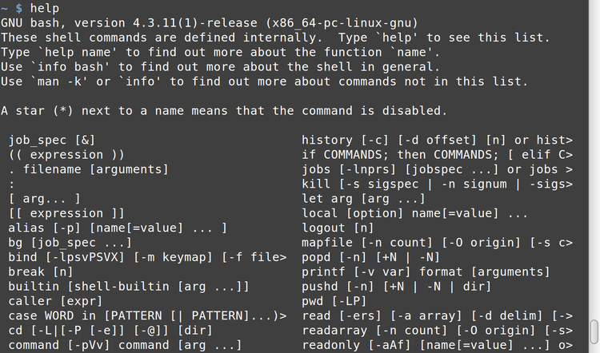
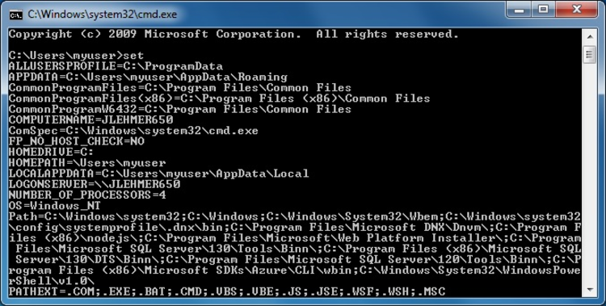

  
# Come Out of Your Shell

***`sh` vs. `ash` vs. `bash` vs. everything else, "REPL”, interactive vs.
scripts, command history, tab expansion, environment variables and "A path!
A path!"***

> *"If you hold a shell up to your ear, you can hear the OS."* - me

To avoid getting all pedantic, I am just going to define a shell as an
environment in which you can execute commands. People tend to think of
a shell as a "command prompt," but you can run a shell without running
a command prompt, but not vice versa - an interactive command prompt is
an instance of a shell environment almost by definition.

Examples of shells:

* [**`CMD.EXE`**](https://technet.microsoft.com/en-us/library/cc754340.aspx) -
yes, Windows has a shell.

* [**`PowerShell.exe`**](https://technet.microsoft.com/en-us/library/ms714469%28v=VS.85%29.aspx) -
in fact, it has at least two!

In UNIX-land:

* [**`sh`**](https://en.wikipedia.org/wiki/Bourne_shell) - the "original"
Bourne shell in UNIX, which spawned:

    * [**`ash`**](https://en.wikipedia.org/wiki/Almquist_shell) - Almquist
    shell.

        * **`dash`** - Debian Almquist shell (replaced `ash` in Debian)

    * [**`bash`**](https://en.wikipedia.org/wiki/Bash_%28Unix_shell%29) -
    Bourne-again shell (get it?), the "standard" Linux shell.

    * [**`ksh`**](https://en.wikipedia.org/wiki/Korn_shell) - Korn shell.

    * [**`zsh`**](https://en.wikipedia.org/wiki/Z_shell) - Z shell.

* [**`csh`**](https://en.wikipedia.org/wiki/C_shell) - C shell,
historically it is the default shell on BSD systems (although there are
arguments on why you should
[***never use it***](http://www.faqs.org/faqs/unix-faq/shell/csh-whynot/)).

* **...and many more!** -
[tons, really](https://en.wikipedia.org/wiki/Unix_shell#Shell_categories).

Most Linux distros use `bash`, but the BSDs are all over the place. We're
going to assume `bash` for the rest of this tutorial. With few
modifications, anything in the `sh` hierarchy above can usually run in the
other members of the same tree.

## `bash` Built-Ins

Every shell has some "built-in" commands that are implemented as part
of the shell and not as an external command or program, and `bash` has its
share, as shown by running the [`help`](http://linux.die.net/man/1/help)
command in a `bash` terminal:

\ifxetex
\begin{figure}[!htbp]
\includegraphics{./images/help.png}%
\caption{Built-in commands}%
\end{figure}
\else



\fi

Why does this matter? Because if you are in an environment and something
as fundamental as `echo` isn't working, you may not be working in a shell
that is going to act like a "`sh`" shell. ***In general***, `sh`, `ash`,
`bash`, `dash` and `ksh` all act similarly enough that you don't care,
but sometimes you may have to care. Knowing if you are on a `csh` variant
or even something more esoteric can be key.

Pay attention to the first line in script files, which will typically
have a ["shebang"](https://en.wikipedia.org/wiki/Shebang_%28Unix%29) line
that looks like this:

```
#!/bin/bash
```

In this case we know the script is expecting to be executed by `bash`,
and in fact should throw an error if `/bin/bash` doesn't exist. Note
that on some systems:

```
#!/bin/sh
```

...is pointing to an alias of `bash`, and on some it is a different
implementation of the original `sh` command, such as `ash` or `dash`. Now
you know what to google if you hit problems as simple as an expected
built-in command not being found.

## Everything You Know is (Almost) Wrong

`CMD.EXE` has a lineage that is a mish-mash of CP/M and UNIX excreted
through three decades of backwards compatibility via that devil spawn
we call DOS. It has gotten even muddier over the years as Microsoft has
added more commands, PowerShell, POSIX subsystems, etc.

But even so, there are some similarities. In both `bash` \fref{set-command-in-bash}
and `CMD.EXE` \fref{set-command-in-cmd}
the [`set`](http://linux.die.net/man/1/set) \icmd{set} command shows you all
environment variables that have been set.

\ifxetex\fimg{./images/set.png}{set command in bash}{set-command-in-bash}
\else

\fi

\ifxetex\fimg{./images/set-cmd.png}{SET command in CMD.EXE}{set-command-in-cmd}
\else

\fi

Similarly, the [`echo`](http://linux.die.net/man/1/echo) command can be
used to show you the contents of an environment variable (among other
things):

***bash***

```
~ $ echo $HOME
/home/myuser
```

***CMD.EXE***

```
C:\> echo %homedrive%
C:
```

This example shows some valuable differences between shells, though.
Even though both have the concept of environment variables and echoing
out their contents using the "same" command, note that:

1. The syntax for accessing an environment variable is `$variable` in
`bash` and `%variable%` in `CMD.EXE`.

2. `bash` is case-sensitive and so `echo $HOME` works but `echo
$home` does not. `CMD.EXE` is ***not*** case-sensitive, so either
`echo %homedrive%` or `echo %HOMEDRIVE%` (or `EcHo %hOmEdRiVe%`)
would work.

One final note of caution. You can set up command aliases in `bash`
and other shells that allow you to define a `CMD.EXE`-style `dir`
as a substitute the `ls` command in `bash`, or `copy` for `cp`,
`del` for `rm`, and so on. I recommend you don't do this for at
least two reasons:

1. It is difficult to get these right in terms of being able to map
all the various parameters from the `bash` command to the appropriate
parameters for a `CMD.EXE`-style command. Most people don't go that
far, which means you then end up with a "toy" substitute for the
`CMD.EXE` command, and have to fall back to the native commands
anyway.

2. It simply delays you actually learning about the "UNIX" environment.
You end up relying on a crutch that then must be replicated on every
system you touch. In my opinion it is better to just learn the native
commands, because then you are instantly productive at any shell
window.

## You're a Product of Your Environment (Variables)

It is much more common to set up environment variables to control
execution in Linux than in Windows. In fact, it is quite common to
override a given environment variable for the single execution of a
program, to the point that `bash` has built-in "one-line" support for it:

```
~ $ FOO=myval /home/myuser/myscript
```

This sets the environment variable `FOO` to "myval" but only for the
duration and scope of running `myscript`.

By convention, environment variables are named all uppercase, whereas all
scripts and programs tend to be named all lowercase. Remember, almost
without exception Linux and company are case-sensitive and Windows is not.

You can set or override multiple variables for a single command or script
execution simply by separating them with spaces:

```
~ $ FOO=myval BAR=yourval BAZ=ourvals /home/myuser/myscript
```

Note that passing in values in this way does not safeguard sensitive
information from other users on the system who can see the values at
least while the script is running using the `ps -x` command.

You can also set the value of environment variables to the output of a
command by surrounding it with paired \` ("back ticks", or "grave accent"):

```
~ $ filetype=`file --print --mime-type --no-pad --print0 otschecker.csv`
~ $ echo $filetype
otschecker.csv: text/plain
```

### Who Am I?

When writing scripts that can be run by any user, it may be helpful to
know their user name at run-time. There are at least two different ways to
determine that. The first is via environment variables:

```
~ $ echo $USER
myuser
```

The second is with a command with one of the best names, ever -
[`whoami`](http://linux.die.net/man/1/whoami):

```
~ $ whoami
myuser
```

Some environments set the `$USER` environment variable, some set a
`$USERNAME` variable, and some like Mint set both. I think it is better
to use `whoami`, which tends to be on almost all systems.

## Paths (a Part of Any Balanced Shrubbery)

The concept of a "path" for finding executables is almost identical, and
Windows lifted it from UNIX (or CP/M, which lifted it from UNIX). Look at
the output of the `PATH` environment variable under `bash`:

```
~ $ echo $PATH
/usr/local/bin:/usr/bin:/bin:/usr/local/games:/usr/games
```

Echoing the `PATH` environment variable under `CMD.EXE` \fref{echo-path-in-cmd}
works, too. 

\ifxetex\fimg{./images/echo-path-cmd.png}{Echo path in CMD.EXE}{echo-path-in-cmd}
\else

\fi

Note the differences and similarities. Both the paths are evaluated
left to right. Both use separators between path components, a `;` for
DOS and Windows, a `:` for Linux. Both delimit their directory names
with slashes, with `\` for DOS and Windows and `/` for Linux. But Linux
has no concept of a "drive letter" like `C:`, and instead everything is
rooted in a single namespace hierarchy starting at the root `/`. We'll be
talking more about directories in the next chapter.

And just to muddy the waters further, notice how Cygwin under Windows shows
the `PATH` environment variable, with `bash` syntax but a combination of both
Cygwin and Windows directories\ \fref{echo-path-cygwin}.

\ifxetex\fimg{./images/echo-path-cygwin.png}{Echo path in Cygwin}{echo-path-cygwin}
\else

\fi

## Open Your Shell and Interact

The actual "command prompt" is when you bring up a shell in an "interactive
session" in a terminal window.  This might be from logging into the console
of a Linux VM, or starting a terminal window in a X window manager like
GNOME or KDE, or `ssh`'ing into an interactive session of a remote
machine, or even running a Cygwin command prompt under Windows.

Command prompts allow you to work in a so-called "REPL" environment
(Read, Evaluate, Print, Loop). You can run a series of commands once,
or keep refining a command or commands until you get them working the
way you want, then transfer their sequence to a script file to capture it.

Real shell wizards can often show off their magic in an incredible
one-liner typed from memory with lots of obscure commands piped together
and invoked with cryptic options.

I am not a real shell wizard. See [chapter 9](#how-do-you-know-what-you-dont-know-man)
for how you can fake it like I do.

## Getting Lazy

Most modern interactive shells like `bash` and `CMD.EXE` allow for
tab expansion and command history, at least for the current session of
the shell.

Tab expansion is "auto-complete" for the command prompt. Let's say you
have some files in a directory as shown in \fref{ls-for-tab-completion}.

\ifxetex\fimg{./images/ls-for-tab-completion.png}{Typical ls command}{ls-for-tab-completion}
\else

\fi

Without tab expansion, typing out something like:

```
~ $ mv Disabled\ User\ Accounts.csv elsewhere/.
```

or 

```
~ $ mv 'Disabled User Accounts.csv' elsewhere/.
```

...is painful. But with tab expansion, we can simply:

```
mv D^t
```

...where `^t` represents hitting the `Tab` key, and since there is only
one file that starts with a "D" tab expansion will fill in the rest of
the file name:

```
~ $ mv Disabled\ User\ Accounts.csv
```

...and then we can go about our business of finishing our command.

One place the tab completion in `bash` is different than `CMD.EXE`
is that in `bash` if you hit `Tab` and there are multiple candidates,
it will expand as far as it can and then show you a list of files that
match up to that point and allow you to type in more characters and hit
`Tab` again to complete it. Whereas in `CMD.EXE` it will "cycle" between
the multiple candidates, showing you each one as the completion option
in turn. Both are useful, but each is subtly different and can give you
fits when moving between one environment and another.

**Pro Tip:** Remember, UNIX was built by people on slow, klunky teletypes
and terminals, and they hated to type! Tab expansion is your friend and
you should use it as often as possible. It gives at least three benefits:

1. Saves you typing.

2. Helps eliminate misspellings in a long file or command name.

3. Acts as an error checker, because if the tab doesn't expand, chances
are you are specifying something else (the beginning path of the file)
wrong.

The other thing to remember about the interactive shell is command
history. Again, both `CMD.EXE` and `bash` give you command history, but
`CMD.EXE` only remembers it for the session, while `bash` stores it in
one of your hidden "profile" or "dot" files in your home directory called
`.bash_history`, which you can display with `ls -a` \fref{ls-a} shows.

\ifxetex\fimg{./images/ls-a.png}{ls command showing hidden files}{ls-a}
\else

\fi

Inside, `.bash_history` is just a text file, with the most recent commands
at the bottom.

The `bash` shell supports a rich interactive environment for searching for,
editing and saving command history. However, the biggest thing you need
to remember to fake it is simply that the up and down arrows work in
the command prompt and bring back your recent commands so you can update
them and re-execute them.

**Note:** If you start multiple sessions under the same account,
the saved history will be of the last login to successfully write back out
`.bash_history`.
  